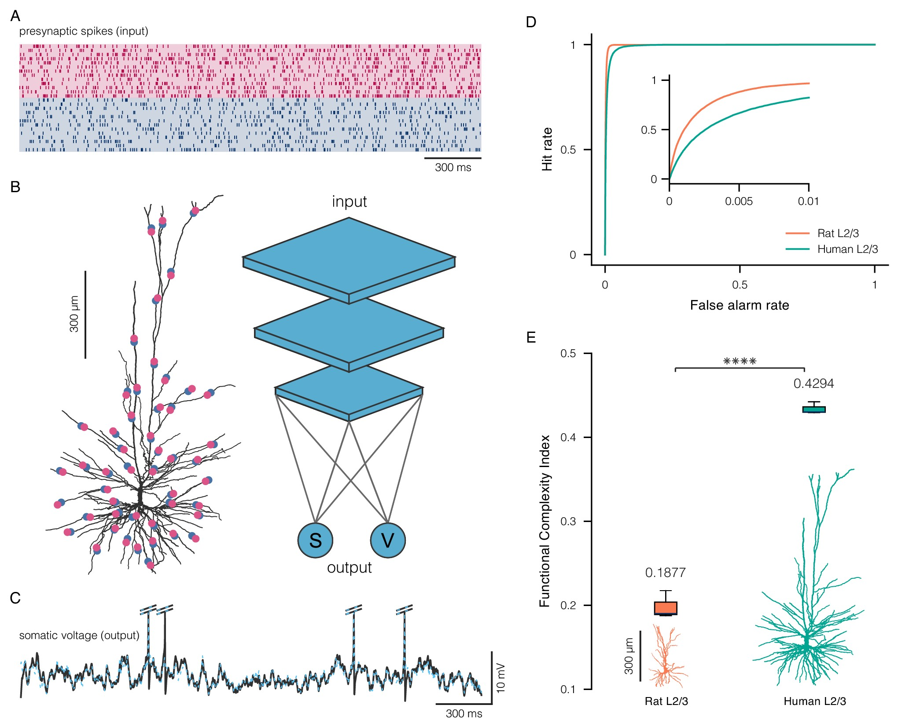

# FCI: Functional Complexity Index

This repository contains the code accompanying the preprint **["What makes human cortical pyramidal neurons functionally complex"](https://www.biorxiv.org/content/10.1101/2024.12.17.628883v1)**

Ido Aizenbud, Daniela Yoeli, David Beniaguev, Christiaan PJ de Kock, Michael London, Idan Segev

## Abstract
Humans exhibit unique cognitive abilities within the animal kingdom, but the neural mechanisms driving these advanced capabilities remain poorly understood. Human cortical neurons differ from those of other species, such as rodents, in both their morphological and physiological characteristics. Could the distinct properties of human cortical neurons help explain the superior cognitive capabilities of humans? Understanding this relationship requires a metric to quantify how neuronal properties contribute to the functional complexity of single neurons, yet no such standardized measure currently exists. Here, we propose the Functional Complexity Index (FCI), a generalized, deep learning-based framework to assess the input-output complexity of neurons. By comparing the FCI of cortical pyramidal neurons from different layers in rats and humans, we identified key morpho-electrical factors that underlie functional complexity. Human cortical pyramidal neurons were found to be significantly more functionally complex than their rat counterparts, primarily due to differences in dendritic membrane area and branching pattern, as well as density and nonlinearity of NMDA-mediated synaptic receptors. These findings reveal the structural-biophysical basis for the enhanced functional properties of human neurons.

